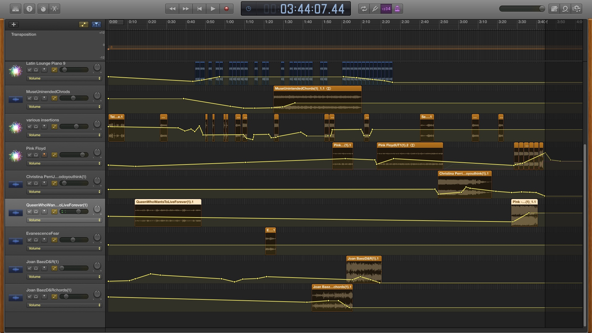

# IASC-2P02

## About ME:
I am a creative person who is also a fulltime employee, mom, grandmother, and a current student of IASC, finishing up my Honours Degree. I am quickly discovering Digital Humanities is a fascinating field of study and one I hope to pursue with continued studies past my BSc.

## BLOG

consectetur adipiscing elit [ continue reading ](blog)

####NOTES: 

Image retreived from https://www.google.com/search?q=digital+humanities&rlz=1CAEAQE_enCA819&source=lnms&tbm=isch&sa=X&ved=0ahUKEwiD1djG1vbgAhWM3oMKHa9RCL0Q_AUIDigB&biw=1366&bih=610#imgrc=56MP2fu3wJ3SUM:
