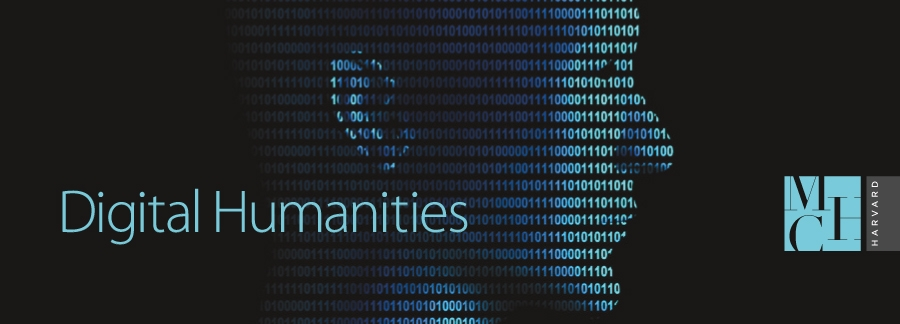

## ABOUT ME

I am a extraordinarly creative person who is also a fulltime employee, mom, grandmother, and a current student of Interactive Arts and Sciences at Brock University upgrading my BA to an Honours Degree. I am quickly discovering Digital Scholarship is a fascinating field of study and one I hope to continue to pursue once I have achieved my full Honours.

## BLOG

Ramsay and Drucker's critique of ...  [ continue reading ](blog)

###### NOTES: Image retreived from https://www.google.com/search?q=digital+humanities&rlz=1CAEAQE_enCA819&source=lnms&tbm=isch&sa=X&ved=0ahUKEwiD1djG1vbgAhWM3oMKHa9RCL0Q_AUIDigB&biw=1366&bih=610#imgrc=56MP2fu3wJ3SUM:
